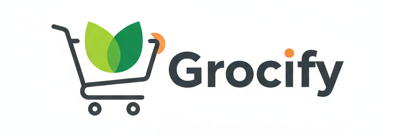

# Angular Grocery Management System

<div align="center">
  
  
  <p><strong>A modern, full-featured grocery store management application built with Angular 21</strong></p>

  
  
  
  
</div>

---

## 📋 Table of Contents

- [Overview](#overview)
- [Features](#features)
- [Tech Stack](#tech-stack)
- [Prerequisites](#prerequisites)
- [Installation](#installation)
- [Usage](#usage)
- [Project Structure](#project-structure)
- [Development](#development)
- [Testing](#testing)
- [Building](#building)
- [Contributing](#contributing)
- [License](#license)
- [Contact](#contact)

---

## 🎯 Overview

The Angular Grocery Management System is a comprehensive web application designed to streamline grocery store operations. It provides an intuitive interface for managing customers, inventory items, orders, and generating insights through an interactive dashboard.

Built with the latest Angular framework and modern web technologies, this application demonstrates best practices in enterprise-level application development.

---

## ✨ Features

- **📊 Dashboard** - Real-time overview of store operations and key metrics
- **👥 Customer Management** - Add, view, update, and manage customer information
- **📦 Inventory Management** - Track and manage grocery items with detailed information
- **🛒 Order Processing** - Create and manage customer orders efficiently
- **🔐 Authentication** - Secure login and registration system
- **📱 Responsive Design** - Fully responsive UI that works on all devices
- **🎨 Modern UI/UX** - Clean interface built with TailwindCSS and Flowbite components

---

## 🛠 Tech Stack

- **Frontend Framework:** [Angular 21.1.0](https://angular.dev/)
- **Language:** [TypeScript 5.9](https://www.typescriptlang.org/)
- **Styling:** [TailwindCSS 4.1](https://tailwindcss.com/)
- **UI Components:** [Flowbite 4.0](https://flowbite.com/)
- **State Management:** RxJS 7.8
- **Testing:** [Vitest 4.0](https://vitest.dev/)
- **Build Tool:** Angular CLI 21.1.3

---

## ⚙️ Prerequisites

Before you begin, ensure you have the following installed on your system:

- **Node.js** (v18.0.0 or higher) - [Download](https://nodejs.org/)
- **npm** (v11.9.0 or higher) - Comes with Node.js
- **Angular CLI** (v21.1.3 or higher) - Install globally:
  ```bash
  npm install -g @angular/cli
  ```

---

## 📥 Installation

Follow these steps to set up the project locally:

1. **Clone the repository**
   ```bash
   git clone https://github.com/amilasuranjith-dev/Angular-grocery-management-system.git
   cd Angular-grocery-management-system
   ```

2. **Install dependencies**
   ```bash
   npm install
   ```

3. **Verify installation**
   ```bash
   ng version
   ```

---

## 🚀 Usage

### Development Server

Start the development server:

```bash
npm start
# or
ng serve
```

The application will be available at `http://localhost:4200/`. The app will automatically reload when you make changes to the source files.

### Production Build

Build the application for production:

```bash
npm run build
# or
ng build
```

The production-ready files will be generated in the `dist/` directory with optimizations for performance and speed.

### Watch Mode

For continuous development builds:

```bash
npm run watch
```

---

## 📁 Project Structure

```
Angular-grocery-management-system/
├── src/
│   ├── app/
│   │   ├── page/
│   │   │   ├── dashboard/      # Dashboard components
│   │   │   ├── customer/       # Customer management
│   │   │   ├── item/           # Inventory management
│   │   │   ├── order/          # Order processing
│   │   │   ├── login/          # Authentication
│   │   │   └── register/       # User registration
│   │   ├── nav/                # Navigation component
│   │   ├── footer/             # Footer component
│   │   ├── app.ts              # Root component
│   │   ├── app.routes.ts       # Route configurations
│   │   └── app.config.ts       # App configuration
│   ├── index.html              # Main HTML file
│   ├── main.ts                 # Application entry point
│   └── styles.css              # Global styles
├── public/                     # Static assets
├── angular.json               # Angular configuration
├── package.json               # Project dependencies
├── tsconfig.json              # TypeScript configuration
└── README.md                  # Project documentation
```

---

## 🔧 Development

### Code Scaffolding

Generate new components, services, or other Angular artifacts:

```bash
# Generate a new component
ng generate component component-name

# Generate a new service
ng generate service service-name

# Generate a new module
ng generate module module-name
```

For a complete list of available schematics:

```bash
ng generate --help
```

### Code Formatting

This project uses Prettier for code formatting. Format your code:

```bash
npx prettier --write .
```

---

## 🧪 Testing

### Unit Tests

Run unit tests using Vitest:

```bash
npm test
# or
ng test
```

### End-to-End Tests

For e2e testing, run:

```bash
ng e2e
```

> **Note:** You may need to install an e2e testing framework (like Cypress or Playwright) that suits your needs.

---

## 🏗 Building

### Development Build

```bash
ng build --configuration development
```

### Production Build

```bash
ng build --configuration production
```

Build artifacts will be stored in the `dist/` directory.

---

## 🤝 Contributing

Contributions are welcome! Please follow these steps:

1. Fork the repository
2. Create a feature branch (`git checkout -b feature/amazing-feature`)
3. Commit your changes (`git commit -m 'Add some amazing feature'`)
4. Push to the branch (`git push origin feature/amazing-feature`)
5. Open a Pull Request

Please ensure your code follows the project's coding standards and includes appropriate tests.

---

## 📄 License

This project is licensed under the MIT License - see the [LICENSE](LICENSE) file for details.

---

## 📞 Contact

**Project Maintainer:** Amila Suranjith

- GitHub: [@amilasuranjith-dev](https://github.com/amilasuranjith-dev)
- Project Link: [https://github.com/amilasuranjith-dev/Angular-grocery-management-system](https://github.com/amilasuranjith-dev/Angular-grocery-management-system)

---

## 🙏 Acknowledgments

- [Angular Team](https://angular.dev/) for the amazing framework
- [TailwindCSS](https://tailwindcss.com/) for the utility-first CSS framework
- [Flowbite](https://flowbite.com/) for the beautiful UI components
- All contributors who help improve this project

---

## 📚 Additional Resources

- [Angular Documentation](https://angular.dev/overview)
- [Angular CLI Reference](https://angular.dev/tools/cli)
- [TailwindCSS Documentation](https://tailwindcss.com/docs)
- [TypeScript Handbook](https://www.typescriptlang.org/docs/)

---

<div align="center">
  Made with ❤️ using Angular
</div>
